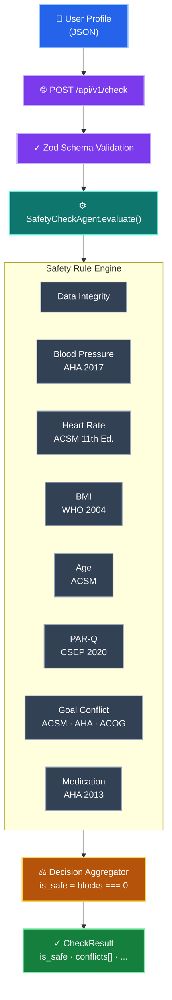

# 🛡️ Safety / Conflict-Check Agent

A deterministic, medically-grounded pre-exercise screening system that validates user profiles against published clinical guidelines before workout session generation.

> **Live Demo:** [https://safety-check-agent.vercel.app](https://safety-check-agent.vercel.app)

---

## Table of Contents

- [Overview](#overview)
- [Approach](#approach)
- [Architecture](#architecture)
- [Tech Stack & Rationale](#tech-stack--rationale)
- [Rule Engine Design](#rule-engine-design)
- [Profile Schema Design](#profile-schema-design)
- [API Reference](#api-reference)
- [Running Locally](#running-locally)
- [Testing](#testing)
- [Assumptions](#assumptions)
- [Future Extensions](#future-extensions)

---

## Overview

This system acts as a **guardrail** — a validation layer that sits before a workout session generation pipeline and answers one question: **"Is it safe to proceed for this user?"**

It ingests a structured user profile (demographics, vitals, fitness goals, health conditions, medications, and PAR-Q+ screening responses), evaluates it against 8 independent safety rules, and returns a boolean `is_safe` decision along with a detailed conflict report.

### What "Conflicts" Mean

The system detects two distinct categories of problems:

| Category | Meaning | Example |
|---|---|---|
| **Data Integrity** | Profile data doesn't add up | Diastolic BP ≥ Systolic BP (physiologically impossible) |
| **Medical Safety** | Profile indicates unsafe conditions for exercise | Stage 2 Hypertension + weight loss goal |

### Three Possible Outcomes

| Outcome | Meaning | Pipeline Action |
|---|---|---|
| ✅ **SAFE** | No blocking conflicts | Proceed to session generation |
| ⚠️ **WARN** | Borderline metrics detected | Proceed, but with modifications needed |
| 🚫 **BLOCK** | Unsafe or contradictory profile | Halt — return explanation to user |

---

## Approach

### Problem Decomposition

I broke this problem into three layers:

1. **Schema Validation** — Is the data structurally valid? (Zod handles this)
2. **Rule Evaluation** — Does the data violate any medical safety rule? (Rule engine)
3. **Decision Aggregation** — What's the overall verdict? (Agent orchestrator)

### Key Design Decisions

**1. Deterministic over probabilistic.** Every rule uses hard thresholds from published medical guidelines. There is no randomness, no LLM, no heuristic guessing. The same profile always produces the same result. This is non-negotiable for a safety-critical system.

**2. "Doctor in the loop" philosophy.** Every threshold in the rule engine is traceable to a published medical guideline (AHA, ACSM, WHO, CSEP PAR-Q+). The system codifies clinical decision-making — it doesn't invent its own medical logic.

**3. Single-pass, no short-circuiting.** All 8 rules evaluate every profile. We never stop at the first failure. A user with both hypertension AND a positive PAR-Q response needs to see both flags. Complete information is more valuable than fast failure.

**4. Registry pattern for extensibility.** Rules are self-contained modules that implement a common interface. Adding a new rule (e.g., "pre-diabetes + high-sugar training") requires writing one file and registering it — zero changes to core logic.

**5. Boolean output, rich internals.** The API surface is `is_safe: boolean` (as specified), but internally every conflict carries severity, category, detail, recommendation, and medical citation. This makes the system ready for constraint-based session modification without changing the rule engine.

---

## Architecture



---

## Tech Stack & Rationale

| Component | Technology | Why This Over Alternatives |
|---|---|---|
| **Runtime** | Next.js 15 + TypeScript | Full-stack in one deployment. TypeScript's type system (discriminated unions, literal types) makes the rule engine self-documenting and compile-time safe. |
| **Schema Validation** | Zod v4 | Define schema once → get TypeScript types + runtime validation. Same philosophy as Pydantic but native to the TS ecosystem. |
| **Rule Engine** | Custom TypeScript classes | Zero dependencies. Fully auditable. Each rule is a standalone file implementing a `Rule` interface. |
| **Testing** | Vitest | Jest-compatible API, significantly faster execution. 12 integration tests covering all rule paths. |
| **Frontend** | React 19 (App Router) | Same codebase as API. Component-based UI for the demo. |
| **Styling** | Vanilla CSS | Full design control. Dark glassmorphism theme with medical-grade color coding. |
| **Deployment** | Vercel | Zero-config deployment from GitHub. Free tier. Auto-HTTPS. |

---

## Rule Engine Design

### Rule Interface

Every rule implements this contract:

```typescript
interface Rule {
  name: string;
  description: string;
  medical_reference: string;
  evaluate(profile: UserProfile): Conflict[];
}
```

### All 8 Rules

| # | Rule | Medical Authority | What It Catches |
|---|---|---|---|
| 1 | `DataIntegrityRule` | Clinical consensus | Diastolic ≥ Systolic; narrow pulse pressure; beginner claiming 6+ days/week; underweight + weight-loss goal; contradictory condition/medication selections |
| 2 | `BloodPressureRule` | AHA/ACC 2017 Guideline | Hypotension; Stage 1 HT (WARN); Stage 2 HT (BLOCK); Hypertensive Crisis (BLOCK) |
| 3 | `HeartRateRule` | ACSM 11th Edition | Extreme bradycardia (<30); tachycardia (100–119); severe tachycardia (≥120); beta-blocker HR zone invalidation |
| 4 | `BMIRule` | WHO Technical Report 894 | Severe thinness (<15); underweight; Obese Class I/II/III — severity scaled by fitness goal intensity |
| 5 | `AgeRule` | ACSM Pre-participation Screening | Youth (12–17) growth plate risk with muscle gain; older adults (65+) + PARQ positive; advanced age + high-intensity goals |
| 6 | `PARQRule` | CSEP PAR-Q+ 2020 | Any positive PAR-Q response → unconditional BLOCK. This is the strictest rule. |
| 7 | `GoalConflictRule` | ACSM/AHA/ACOG | Heart disease + endurance; pregnancy + weight loss; recent surgery; hypertension + high-intensity; osteoporosis + impact; diabetes management; asthma + endurance; chronic back pain + muscle gain |
| 8 | `MedicationRule` | AHA Exercise Standards 2013 | Blood thinner impact risk; insulin hypoglycemia; diuretic dehydration; statin myalgia under load |

### Conflict Output Structure

```typescript
interface Conflict {
  rule: string;             // "BloodPressureRule"
  severity: "BLOCK" | "WARN";
  category: "DATA_INCONSISTENCY" | "MEDICAL_RISK" | "GOAL_MISMATCH" | "CONTRAINDICATION" | "MEDICATION_INTERACTION";
  field: string;            // Profile field involved
  detail: string;           // Human-readable description
  medical_reference: string; // Published guideline citation
  recommendation: string;   // Actionable next step
}
```

---

## Profile Schema Design

The schema is inspired by the **PAR-Q+ (Physical Activity Readiness Questionnaire Plus)** — the internationally recognized pre-exercise screening tool used by certified fitness professionals.

### Fields

| Group | Fields | Purpose |
|---|---|---|
| Demographics | `age`, `sex`, `height_cm`, `weight_kg` | BMI calculation, age-based safety rules |
| Vitals | `resting_heart_rate`, `blood_pressure_systolic`, `blood_pressure_diastolic` | Cardiovascular risk assessment |
| Fitness | `fitness_goal`, `activity_level`, `experience_level`, `weekly_workout_days` | Goal-condition conflict detection |
| Health | `self_reported_conditions` (11 options) | Contraindication screening |
| Medications | `medications` (6 options) | Drug-exercise interaction flags |
| PAR-Q+ | 5 boolean screening questions | Universal pre-exercise clearance gate |

### Computed Metrics

BMI, BP category (AHA 2017), and RHR category (ACSM) are derived from raw input — never user-supplied — to prevent classification errors.

---

## API Reference

### `POST /api/v1/check`

Run a safety check on a user profile.

**Request Body:** `UserProfile` JSON object (see schema above)

**Response (200):**

```json
{
  "is_safe": false,
  "risk_level": "HIGH",
  "total_conflicts": 2,
  "blocks": 1,
  "warnings": 1,
  "conflicts": [
    {
      "rule": "BloodPressureRule",
      "severity": "BLOCK",
      "category": "MEDICAL_RISK",
      "field": "blood_pressure",
      "detail": "Stage 2 Hypertension detected (160/100 mmHg)...",
      "medical_reference": "AHA/ACC 2017 Guideline...",
      "recommendation": "Obtain physician clearance..."
    }
  ],
  "checked_at": "2026-08-14T06:29:07.257Z",
  "profile_hash": "sha256:fce5908a86716117"
}
```

**Error (422):** Zod validation failure with field-level errors.

### `GET /api/v1/rules`

Lists all registered rules with descriptions and medical references.

### `GET /api/v1/health`

Returns `{ status: "ok", rules_loaded: 8, version: "1.0.0" }`.

---

## Running Locally

```bash
# Clone
git clone https://github.com/ritam03/safety-check-agent.git
cd safety-check-agent

# Install
npm install

# Run development server
npm run dev
# → http://localhost:3000

# Run tests
npm test

# Type-check
npx tsc --noEmit
```

**Requirements:** Node.js 18+ and npm.

---

## Testing

12 integration tests covering all rule paths:

```
 ✓ __tests__/integration.test.ts (12 tests)
   ✓ should pass a healthy adult profile with zero conflicts
   ✓ should BLOCK a profile with Stage 2 Hypertension
   ✓ should BLOCK on any positive PAR-Q response
   ✓ should BLOCK when diastolic >= systolic (data integrity)
   ✓ should WARN on Stage 1 Hypertension
   ✓ should BLOCK pregnancy + weight_loss goal
   ✓ should WARN on beta-blocker usage (medication interaction)
   ✓ should BLOCK recent surgery + any goal
   ✓ should WARN for youth (age 15) with muscle_gain goal
   ✓ should accumulate multiple conflicts from different rules
   ✓ should validate the Zod schema rejects invalid input
   ✓ should assign correct risk levels
```

```bash
npm test
```

---

## Assumptions

1. **Self-reported data.** All health data (BP, RHR, conditions) is user-entered, not device-synced. The system treats values as potentially inaccurate — the `DataIntegrityRule` catches implausible values, and recommendations advise verification.

2. **Static profile snapshot.** The check evaluates a profile at a point in time. It does not track longitudinal trends (e.g., BP improving over weeks).

3. **Published thresholds, not proprietary.** All rule thresholds come from internationally recognized medical guidelines (AHA, ACSM, WHO, CSEP). In production, a clinical advisory board would review and potentially customise these.

4. **BLOCK halts, doesn't delete.** The agent returns a decision. The session generator is responsible for acting on it (halting or modifying the session).

5. **No authentication.** The demo API is open. In production, this endpoint would sit behind auth middleware since it processes health data (PII/PHI).

6. **Age scope: 12–100.** Below 12 is out of scope for exercise programming; above 100 is treated as implausible input.

---

## Future Extensions

### 1. Constraint-Based Session Modification

Instead of just blocking, return a `constraints` object that the session generator can consume:

```json
{
  "is_safe": true,
  "constraints": {
    "max_intensity": "moderate",
    "excluded_exercise_types": ["high_impact_cardio", "heavy_compound_lifts"],
    "max_session_duration_minutes": 30,
    "mandatory_warmup_minutes": 10,
    "hr_ceiling_bpm": 130,
    "use_rpe_instead_of_hr": true
  }
}
```

This is the natural evolution the evaluator described — replacing exercises, tweaking intensity, reducing session time.

### 2. Rule Versioning

Tag each rule with a version number and changelog. When a medical guideline is updated (e.g., AHA revises BP thresholds), deploy a new rule version without breaking existing audit trails.

### 3. Doctor Review Portal

For WARN-level profiles, allow a human clinician to review and override the decision. Log the override with the doctor's credentials and justification for audit compliance.

### 4. Longitudinal Tracking

Store check results over time per user. Detect trends (e.g., BP consistently improving → relax constraints). This turns the one-shot check into a health trajectory system.

### 5. Wearable Device Integration

If health data comes from wearables (smartwatch HR, BP cuff), the confidence in the data increases. The `DataIntegrityRule` could be relaxed for device-sourced values, and the system could accept real-time vitals for intra-session monitoring.

### 6. Internationalisation of Thresholds

BMI thresholds differ by ethnicity (WHO recommends lower cut-offs for South Asian populations). The rule engine could accept a `region` parameter to adjust thresholds accordingly.